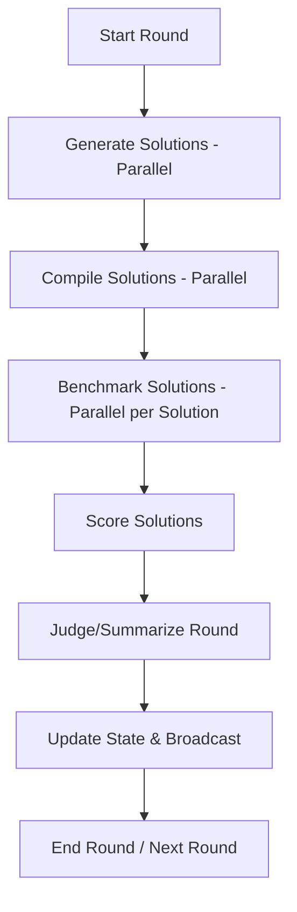

# AI Optimization Arena: Architectural Summary

## System Overview
The AI Optimization Arena is a full-stack platform for benchmarking and iteratively improving C++ algorithmic solutions using multiple LLMs. The system coordinates model generation, sandboxed execution, and automated judging.

## Core Components

### 1. Backend (Python/FastAPI)
- **API Layer**: RESTful endpoints for managing problems, runs, and viewing results.
- **WebSocket**: Real-time streaming of execution status and benchmark results.
- **Orchestration Engine**: Manages the multi-round loop, calling LLMs via OpenRouter, and coordinating the sandbox.
- **Data Layer**: SQLAlchemy with SQLite for persistence. File-based storage for source code and test cases.

### 2. Sandbox (Docker/C++)
- **Dockerized Environment**: Isolated containers for compilation and execution.
- **Test Harness**: A custom C++ runner that executes solutions, enforces limits, and reports performance metrics in JSON.
- **Security**: Static code analysis (safety checks) and whitelisted compiler flags.

### 3. Frontend (React/Vite)
- **Dashboard**: Live view of ongoing runs with leaderboards and performance charts.
- **Configuration**: Detailed forms for setting up runs, models, and prompt templates.
- **Analysis**: Deep-dive views for rounds, solutions, and raw API calls.

## Data Flow
1. **User** creates a **Run** with a **Problem** and **Models**.
2. **Orchestration Engine** starts a **Round**.
3. **Models** generate C++ code (via OpenRouter).
4. **Sandbox** compiles and benchmarks code against **Test Cases**.
5. **Judge Model** summarizes the round.
6. **Results** are persisted and broadcasted via **WebSocket**.
7. **Cycle** repeats for the configured number of rounds.

## Mermaid Diagram: Orchestration Loop

## Key Technical Decisions
- **SQLite**: Chosen for simplicity and local persistence as per spec.
- **Docker-py**: Used for programmatic control over the sandbox.
- **OpenRouter**: Unified API for accessing various LLMs.
- **Tailwind CSS**: For rapid, consistent UI development.
