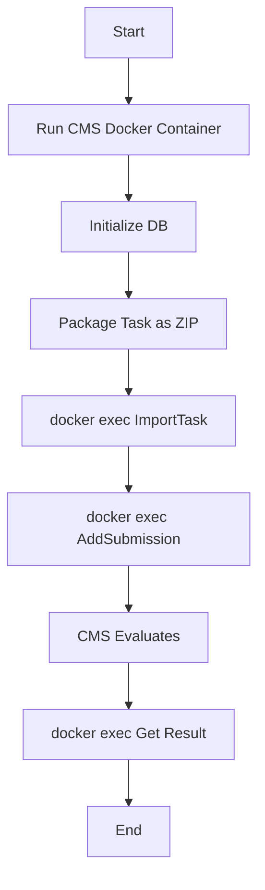

# CMS Migration Plan (Docker-Based Approach)

This document outlines the plan to migrate the test execution sandbox to a fully integrated CMS workflow, running inside a Docker container to ensure compatibility with Windows.

## 1. Research Findings

- **Core Idea**: We will use the official CMS Docker image to create a self-contained environment for all evaluation tasks. This avoids OS compatibility issues and leverages the official CMS setup.
- **Key Scripts**:
  - `docker/cms-dev.sh`: This script starts a development container with the CMS source code mounted, which is ideal for our needs.
  - `cms/cmscontrib/ImportTask.py`: Imports a task from a zip file.
  - `cms/cmscontrib/AddSubmission.py`: Adds a submission for a user and task.
- **Workflow**:
  1. **Start Container**: Use `docker/cms-dev.sh` to start the CMS container.
  2. **Initialize DB**: Run `createdb` and `cmsInitDB` inside the container.
  3. **Execute Commands**: Use `docker exec` to run commands inside the running container.
  4. **Package Task**: Create a zip file with the task.
  5. **Import Task**: Use `docker exec` to run `ImportTask.py`.
  6. **Add Submission**: Use `docker exec` to run `AddSubmission.py`.
  7. **Get Results**: Use `docker exec` to query the database for the results.

## 2. Implementation Plan

### Phase 1: Docker & CMS Setup
- **[ ] Build & Run CMS Container**:
  - Execute `docker/cms-dev.sh` to build and start the development container.
- **[ ] Initialize Database**:
  - Use `docker exec` to run `createdb -h devdb -U postgres cmsdb`.
  - Use `docker exec` to run `cmsInitDB`.

### Phase 2: Task Packaging
- **[ ] Create Task ZIP**:
  - Write a Python script to create a zip file with the required structure for `ImportTask.py`.
  - The zip should contain:
    - `task.yaml` (or other supported format).
    - Test case files (`.in`, `.out`).
    - Checker (if any).
  - The zip file will be created on the host and mounted into the container.

### Phase 3: Submission & Evaluation
- **[ ] Implement `backend/sandbox/cms_evaluator.py`**:
  - **`import_task(zip_path)`**:
    - Executes `docker exec <container_name> cmsImportTask ...` with the zip file.
  - **`add_submission(task_name, solution_path, language)`**:
    - Executes `docker exec <container_name> cmsAddSubmission ...`.
  - **`get_result(submission_id)`**:
    - Executes `docker exec <container_name> psql ...` to query the database for the result.

### Phase 4: Integration with Benchmark
- **[ ] Refactor `backend/sandbox/benchmark.py`**:
  - **Logic**:
    1. **Start Container**: Ensure the CMS container is running.
    2. **Package**: Call `cms_evaluator.create_task_zip`.
    3. **Import**: Call `cms_evaluator.import_task`.
    4. **Submit**: Call `cms_evaluator.add_submission`.
    5. **Poll**: Repeatedly call `cms_evaluator.get_result` until evaluation is complete.
    6. **Map**: Map the CMS result to `BenchmarkSummary`.

### Phase 5: Service Management
- **[ ] Start CMS Services**:
  - Before running the benchmark, use `docker exec` to start the required CMS services inside the container (e.g., `cmsEvaluationService`, `cmsWorker`).

## 3. Mermaid Diagram

